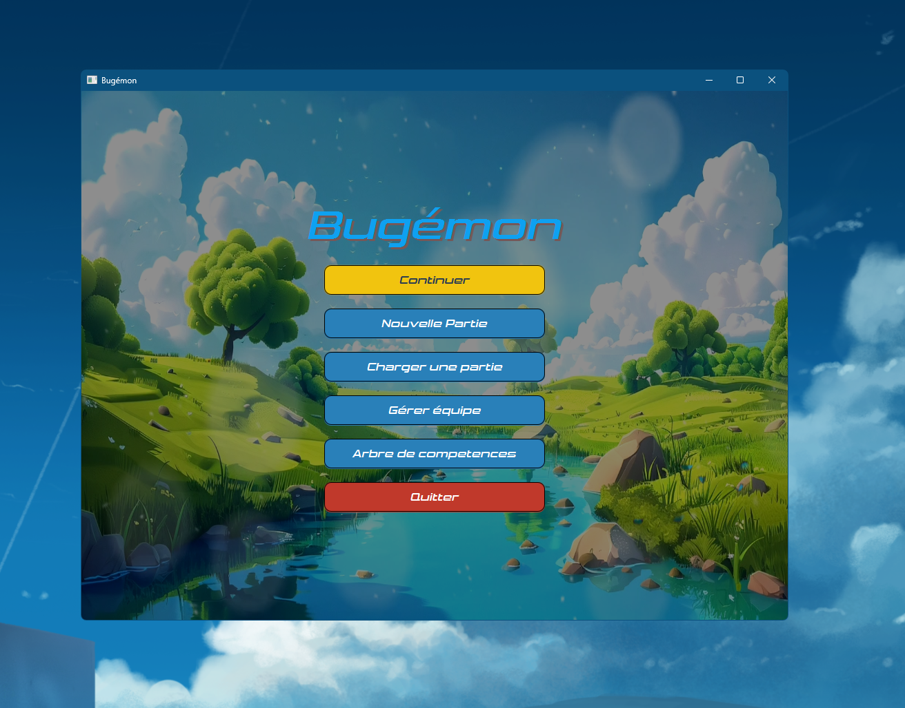
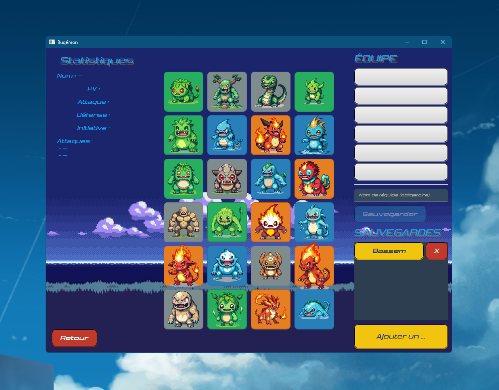
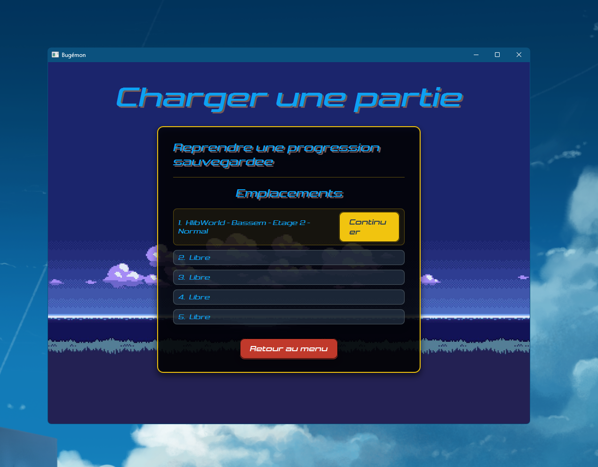
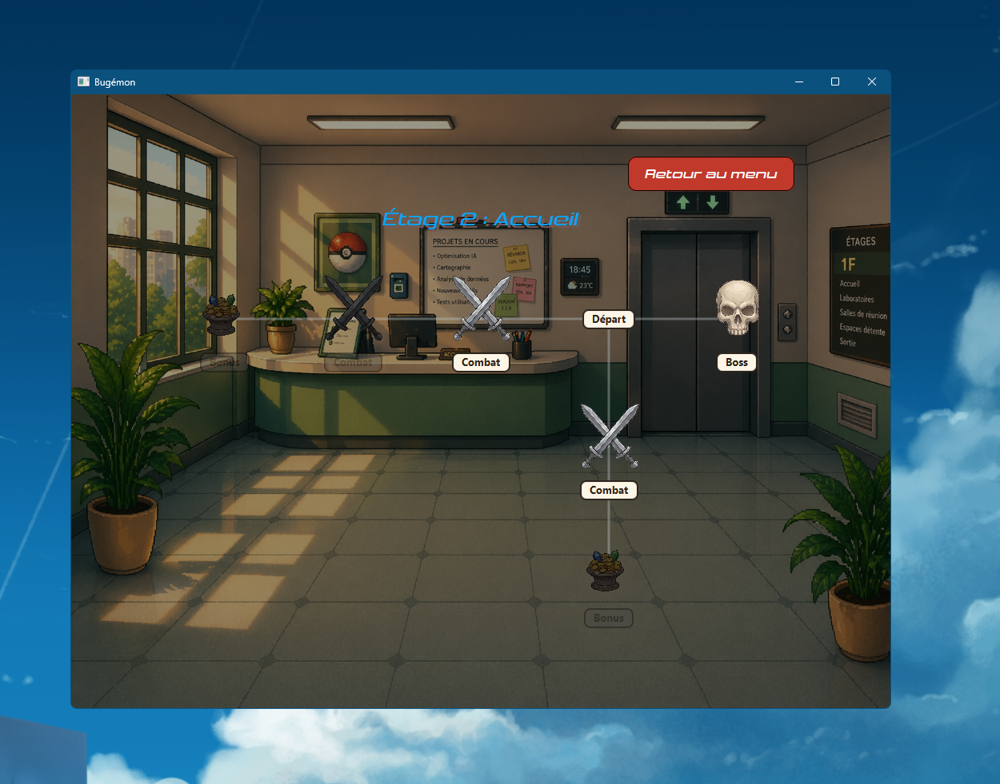
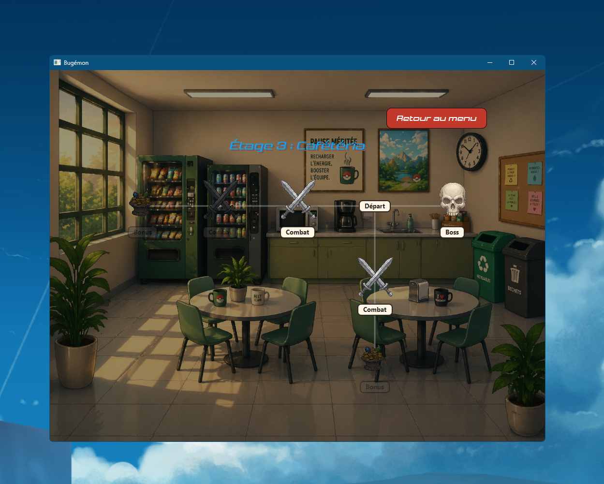
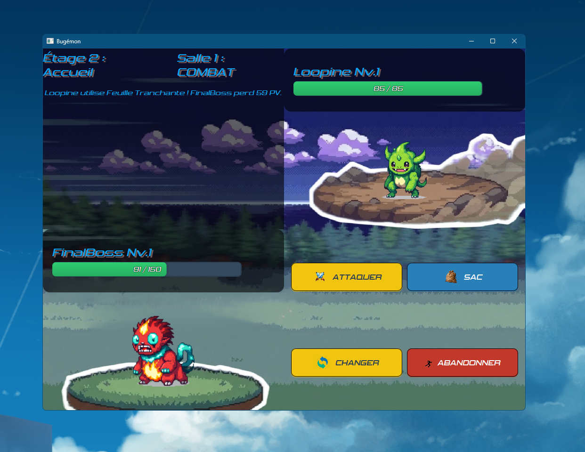
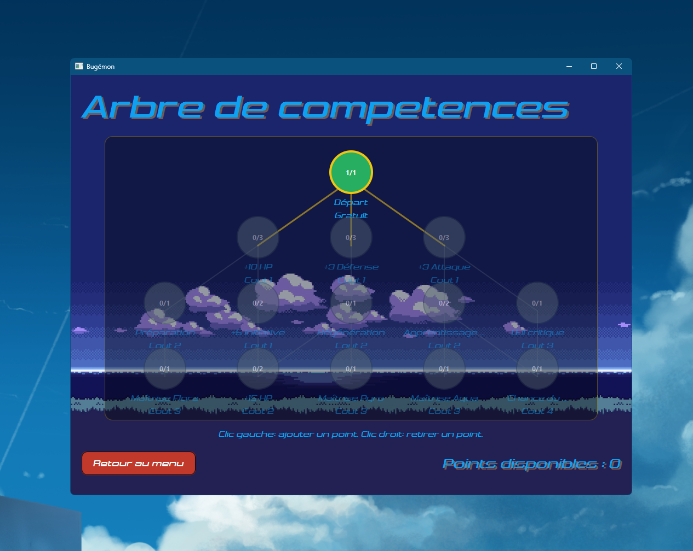
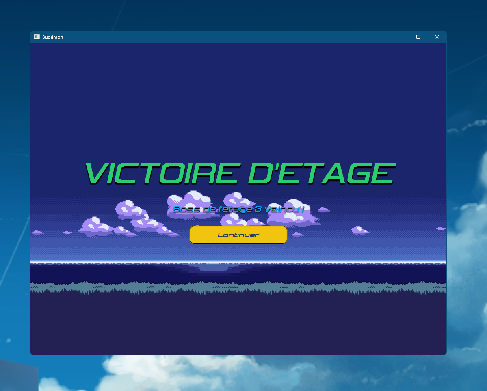
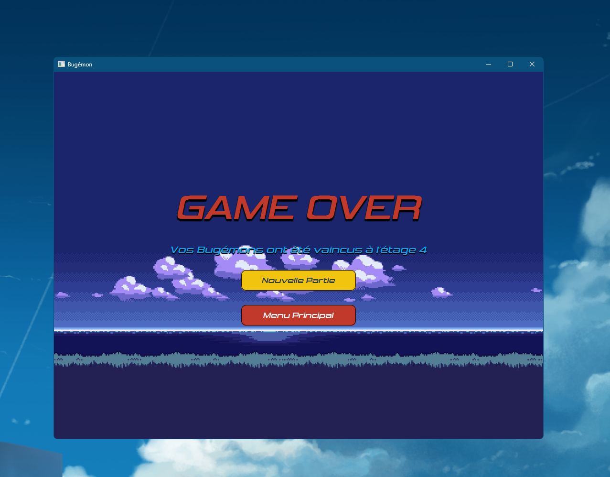

# INFO-F307 - Genie logiciel et gestion de projets 
# Bugemon


---
## Table des matieres

- [Captures du projet](#-captures-du-projet)
- [Structure du projet](#-structure-du-projet)
- [Prerequis](#-prerequis)
- [Verification de l'environnement](#-verification-de-lenvironnement)
- [Dependances](#-dependances)
- [Compiler et lancer](#-compiler-et-lancer)
- [Tests](#-tests)
- [Commandes utiles](#-commandes-utiles)
- [Generer et lancer le .jar](#-generer-et-lancer-le-jar)
- [Problemes frequents](#-problemes-frequents)
- [Documentation Javadoc](#-documentation-javadoc)
- [Travail d'equipe](#-travail-dequipe)
- [Structure du projet](#-structure-du-projet)
- [Repartition des taches](#-repartition-des-taches)

---

## 📸 Captures d’écran

| Menu principal                                             | Gameplay                                               | Gameplay 2                                             |
|------------------------------------------------------------|--------------------------------------------------------|--------------------------------------------------------|
|  |  |  |

| Restart                                               | Game Over                                               | Victoire                                              |
|-------------------------------------------------------|---------------------------------------------------------|-------------------------------------------------------|
|  |  |  |

| Restart                                                   | Game Over                                            | Victoire                                             |
|-----------------------------------------------------------|------------------------------------------------------|------------------------------------------------------|
|  |  |  |


## 🗂️ Structure du projet

```text
Bugemon/
├── pom.xml
├── readme.md
├── iteration-1.jar
├── iteration-2.jar
├── iteration-3.jar
├── iteration-4.jar
├── src/
│   ├── main/
│   │   ├── java/ulb/
│   │   │   ├── Main.java
│   │   │   ├── audio/
│   │   │   │   └── AudioManager.java
│   │   │   ├── controller/
│   │   │   │   ├── AudioConfig.java
│   │   │   │   ├── BattleController.java
│   │   │   │   ├── BattleFlowController.java
│   │   │   │   ├── MainController.java
│   │   │   │   ├── NavigationController.java
│   │   │   │   ├── RunLifecycleController.java
│   │   │   │   ├── SceneManager.java
│   │   │   │   └── TeamManagerController.java
│   │   │   ├── dto/
│   │   │   │   ├── BattleStateDTO.java
│   │   │   │   ├── BugemonDisplayDTO.java
│   │   │   │   ├── FloorMapDTO.java
│   │   │   │   ├── SkillTreeStateDTO.java
│   │   │   │   └── ...
│   │   │   ├── models/
│   │   │   │   ├── battle/
│   │   │   │   ├── data/
│   │   │   │   ├── game/
│   │   │   │   └── skilltree/
│   │   │   ├── parsing/
│   │   │   │   ├── AttackData.java
│   │   │   │   ├── BugemonData.java
│   │   │   │   ├── ItemData.java
│   │   │   │   ├── JsonDataLoader.java
│   │   │   │   └── SkillTreeData.java
│   │   │   └── view/
│   │   │       ├── BattleView.java
│   │   │       ├── FloorMapView.java
│   │   │       ├── MainWindowView.java
│   │   │       ├── TeamManagerView.java
│   │   │       └── ...
│   │   └── resources/
│   │       ├── assets/bugemons/png/
│   │       ├── audio/
│   │       ├── css/style.css
│   │       ├── data/
│   │       ├── fonts/
│   │       └── images/
│   └── test/
│       └── java/ulb/
│           ├── controller/
│           ├── models/
│           ├── parsing/
│           └── view/
└── team/
	├── Burnchartdown.ods
	├── histoires_estimations.md
	├── rapport_architecture.md
	└── repartition_taches.md
```

---
## 📌 Prerequis

- **Java** : version minimale requise **18**.
- **Maven** : requis pour compiler, tester et lancer l'application.

## 🔎 Verification de l'environnement

Avant de lancer le projet, verifier que Java et Maven sont bien disponibles :

```powershell
java -version
mvn -version
```

## 📦 Dependances

Ce projet utilise notamment les dependances suivantes :

- **JUnit 4** et **JUnit 5** pour les tests.
- **JavaFX** (`javafx-graphics`, `javafx-fxml`) pour l'interface graphique.
- **TestFX** pour les tests d'interface.
- **Jackson** et **Gson** pour la lecture/ecriture JSON.
- **AssertJ** pour les assertions dans les tests.

---

## ▶️ Compiler et lancer

Pour compiler et executer le projet :

```powershell
mvn compile
mvn exec:java
```
---
## 🧪 Tests

Pour executer les tests :

```powershell
mvn compile
mvn test
```

## ⚙️ Commandes utiles

Commandes rapides pour le workflow courant :

```powershell
mvn clean test
mvn clean install
mvn exec:java
```
---
## 📦 Generer et lancer le .jar

Pour generer le jar :

```powershell
mvn clean install
```

Puis lancer le jar genere (remplacer `NOM_DU_JAR.jar` par le bon fichier dans `target/`) :

```powershell
java -jar target\NOM_DU_JAR.jar
```

Si JavaFX doit etre fourni explicitement a l'execution dans votre environnement :

```powershell
java --module-path CHEMIN_VERS_JAVAFX\lib --add-modules javafx.controls,javafx.fxml -jar target\NOM_DU_JAR.jar
```

## ❗ Problemes frequents

- `java: cannot find symbol method toList()` : verifier que le projet est bien compile avec Java 16+ (ici Java 18 attendu).
- Erreur JavaFX au lancement du jar : fournir `--module-path` et `--add-modules` comme dans l'exemple ci-dessus.
- Les tests GUI peuvent echouer selon l'environnement graphique (CI/headless).
---
## 📚 Documentation Javadoc

Les pages de documentation sont generees dans `target/site/apidocs/`.

Pour generer la Javadoc :

```powershell
mvn javadoc:javadoc -DadditionalJOption=-Xdoclint:none
```
---
## 👥 Travail d'equipe

Les documents d'equipe se trouvent dans `team/`, notamment :

- `team/rapport_architecture.md`
- `team/Burnchartdown.ods`
- `team/repartition_tache.md`
- `team/histoires_estimations.md`
---
## 🧩 Repartition des taches

La repartition detaillee du travail est documentee dans :

- `team/repartition_taches.md`
- `team/histoires_estimations.md`

---
