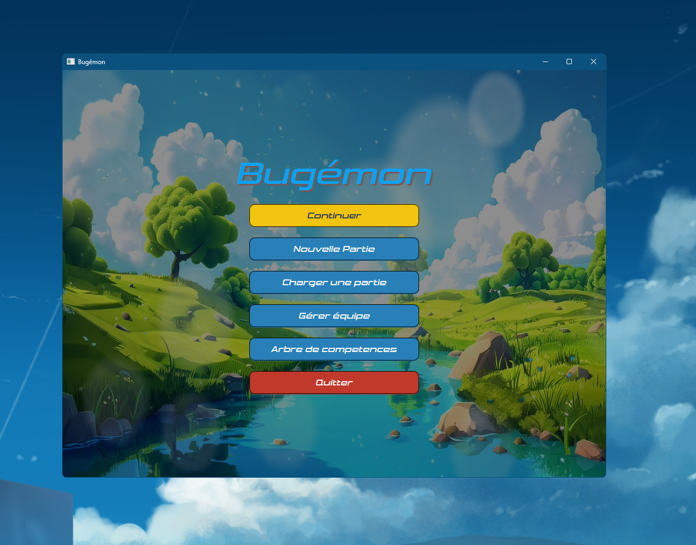
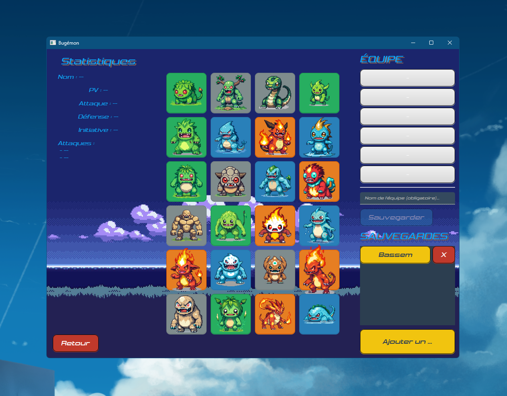
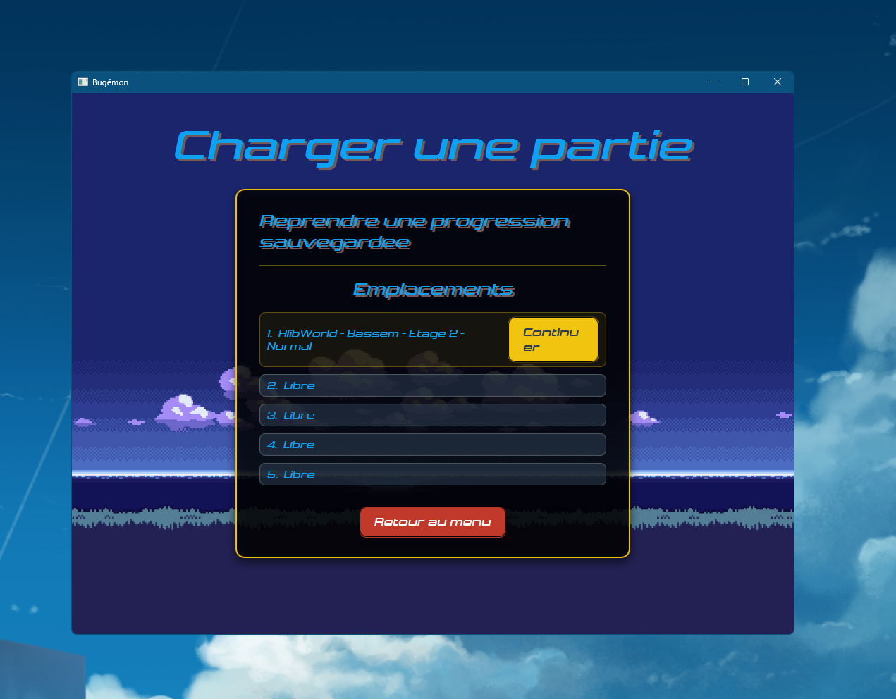
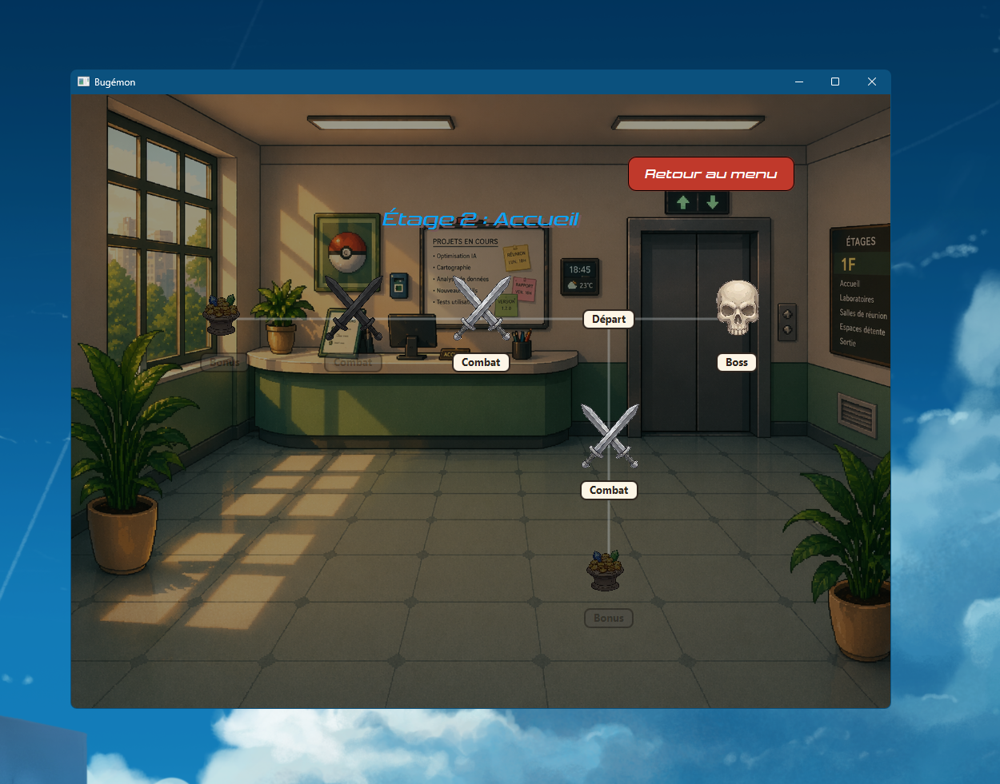
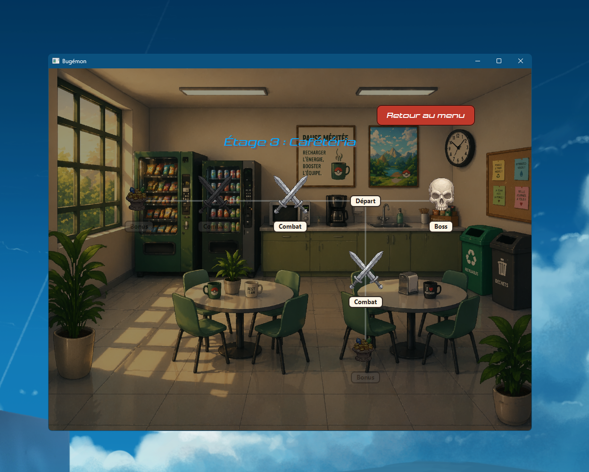
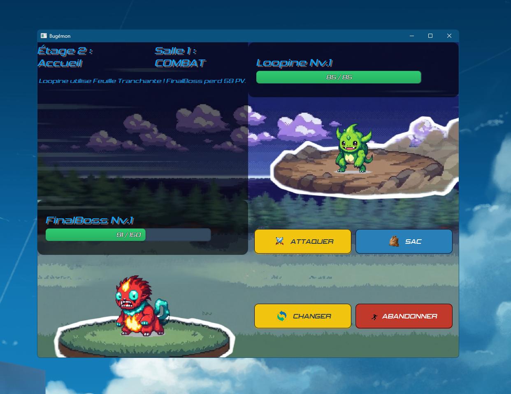
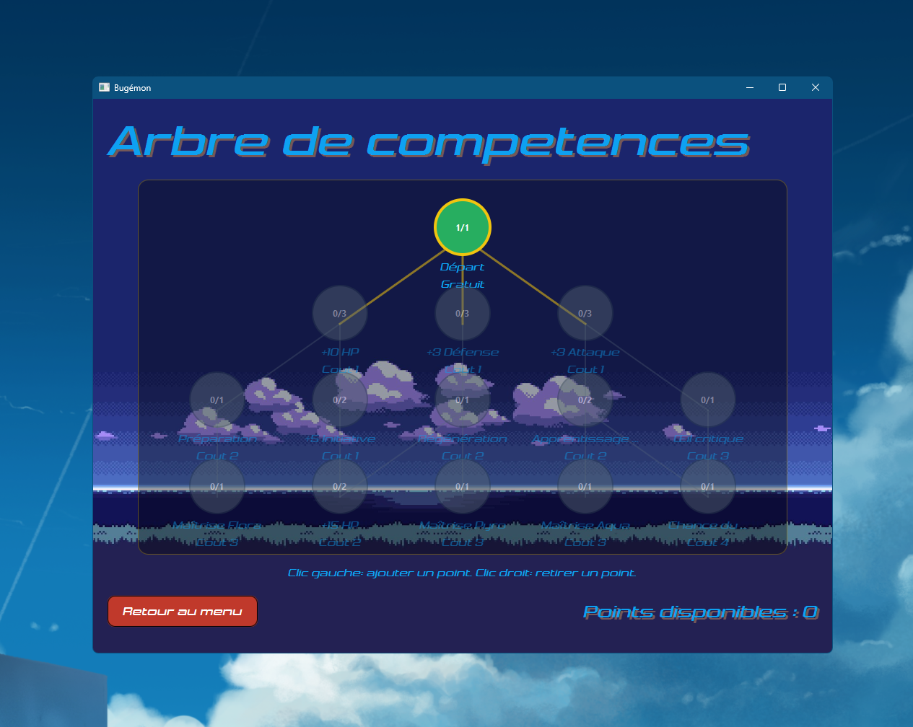
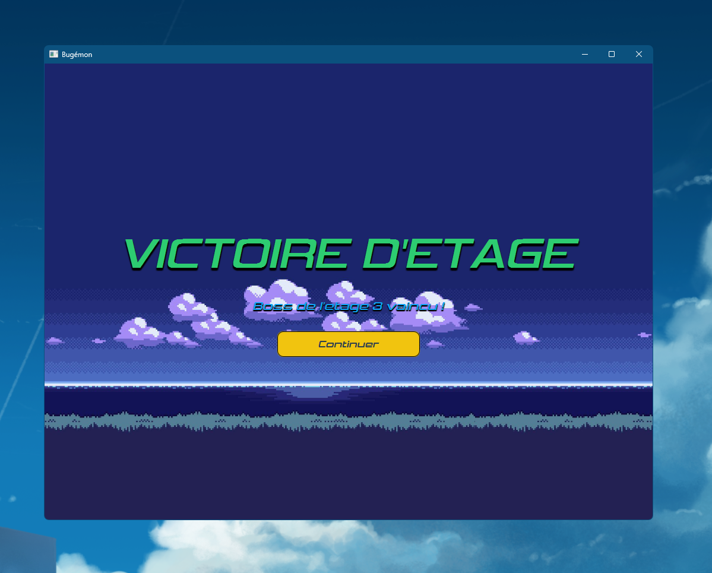
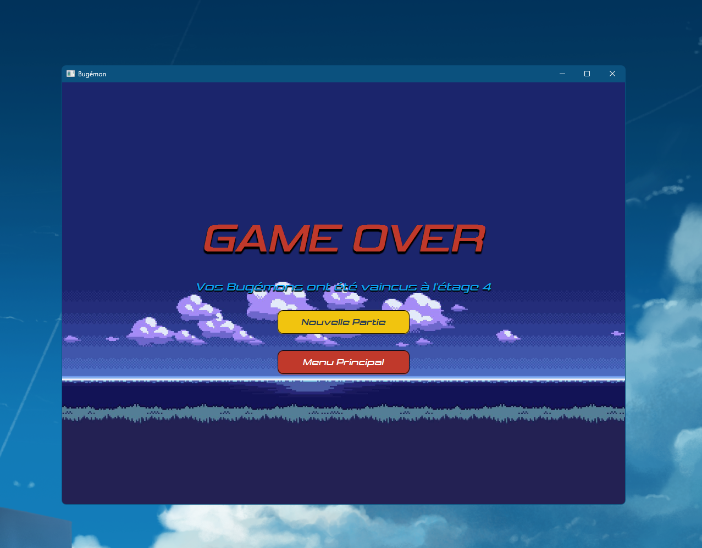

# Bugemon


Bugemon est un jeu de **combat au tour par tour et de progression en JavaFX**. Composez une équipe de Bugémons, explorez les étages de la Tour NO et affrontez des équipes adverses jusqu’au boss final.

Le jeu propose la gestion d’équipes, plusieurs difficultés, des objets de préparation, un arbre de compétences et des emplacements de sauvegarde. Les créatures et les règles s’appuient sur des données JSON.

> Projet académique ULB — INFO-F307
> Génie logiciel et gestion de projets · 2025–2026

<a id="captures-decran"></a>

## 📸 Captures d’écran

| Menu principal | Équipe et exploration | Sélection d’objet |
|---|---|---|
|  |  |  |

| Carte d’étage | Progression dans la tour | Combat |
|---|---|---|
|  |  |  |

| Arbre de compétences | Victoire | Défaite |
|---|---|---|
|  |  |  |

---

## 📖 Sommaire

- [Fonctionnalités](#fonctionnalites)
- [Prérequis](#prerequis)
- [Installation](#installation)
- [Lancement](#lancement)
- [Utilisation](#utilisation)
- [Données et sauvegardes](#donnees-et-sauvegardes)
- [Architecture](#architecture)
- [Flux général](#flux-general)
- [Structure du projet](#structure-du-projet)
- [Tests](#tests)
- [Problèmes fréquents](#problemes-frequents)
- [Documentation](#documentation)
- [Javadoc](#javadoc)
- [Licence](#licence)

<a id="fonctionnalites"></a>

## ✨ Fonctionnalités

- **Constitution d’équipe** : composez une équipe de un à six Bugémons, sauvegardez-la sous un nom, rechargez-la et modifiez-la depuis l’écran de gestion.
- **Création de Bugémon personnalisé** : l’éditeur accepte un nom, un type, des statistiques, trois attaques et une image ; la définition et son sprite sont enregistrés localement.
- **Parties sauvegardées** : une nouvelle partie est associée à une équipe, une difficulté et l’un des cinq emplacements disponibles. Le menu permet aussi de reprendre la dernière partie chargeable.
- **Exploration de la Tour NO** : la carte d’étage distingue les salles de combat, de récompense et de boss. La progression commence à l’étage 2 et se poursuit jusqu’à l’étage 10.
- **Combats au tour par tour** : choisissez une attaque, utilisez un objet, changez de Bugémon ou abandonnez. Les K.O., les effets, les types, l’initiative, les coups critiques et l’expérience sont gérés par le moteur de combat.
- **Récompenses et progression** : les victoires accordent des récompenses et de l’expérience ; les montées de niveau proposent un choix de bonus de statistiques.
- **Arbre de compétences** : les points gagnés dans la progression servent à débloquer des bonus persistants, par exemple sur les statistiques, l’expérience, la régénération, les objets ou les dégâts.
- **Ambiance visuelle et sonore** : les écrans utilisent le CSS, les polices, les sprites, les fonds et les médias fournis dans `src/main/resources`.

<a id="prerequis"></a>

## 🧰 Prérequis

- **JDK 18** : le compilateur Maven est configuré avec `release` 18.
- **Maven** : requis pour résoudre les dépendances, compiler, lancer et tester le projet.
- **Environnement graphique** : nécessaire pour lancer l’interface JavaFX et les tests GUI. Sous CI Linux, le dépôt utilise Xvfb.

Vérifiez les outils installés :

```bash
java -version
mvn -version
```

<a id="installation"></a>

## 📦 Installation

Clonez le dépôt puis placez-vous à sa racine :

```bash
git clone https://github.com/9Chrk/Bugemon.git
cd Bugemon
```

Maven télécharge ensuite les dépendances déclarées dans `pom.xml` : JavaFX (`controls`, `fxml`, `graphics`, `media`), Jackson et Gson pour le JSON, ainsi que JUnit, TestFX et AssertJ pour les tests.

Pour compiler sans lancer l’interface :

```bash
mvn compile
```

<a id="lancement"></a>

## ▶️ Lancement

Le plugin JavaFX Maven est configuré avec `ulb.Main` comme classe principale. Depuis la racine du dépôt :

```bash
mvn javafx:run
```

La commande suivante, déjà configurée avec la même classe principale, est également disponible :

```bash
mvn exec:java
```

La classe `ulb.Main` crée la fenêtre JavaFX, lui donne le titre « Bugémon », puis affiche le menu principal.

<a id="utilisation"></a>

## 🎮 Utilisation

1. Ouvrez **Gérer équipe**, composez une équipe puis sauvegardez-la.
2. Choisissez **Nouvelle Partie**, sélectionnez une difficulté (*Facile*, *Normal* ou *Difficile*) et l’équipe à utiliser.
3. Choisissez un emplacement, donnez un nom à la partie, puis sélectionnez un objet de préparation.
4. Depuis la carte, entrez dans une salle accessible. En combat, les actions disponibles sont **Attaquer**, **Sac**, **Changer** et **Abandonner**.
5. Après une victoire, poursuivez l’exploration, choisissez les récompenses et les bonus de niveau proposés. Utilisez **Charger une partie** ou **Continuer** pour reprendre une sauvegarde.

<a id="donnees-et-sauvegardes"></a>

## 🗃️ Données et sauvegardes

Les catalogues statiques sont lus depuis les ressources JSON :

- `src/main/resources/data/bugemons.json` : définitions, statistiques, types, attaques et sprites des Bugémons ;
- `src/main/resources/data/attaques.json` : attaques et effets ;
- `src/main/resources/data/objets.json` : objets utilisables ;
- `src/main/resources/data/skill_tree.json` : nœuds, prérequis et effets de l’arbre de compétences.

`JsonDataLoader` charge ces fichiers avec Jackson et indexe les entrées par identifiant ; les identifiants dupliqués sont refusés. Les données de profil (équipes, inventaire, emplacements de partie, progression de tour et arbre de compétences) sont sérialisées au format JSON dans `teams_save.json`, à la racine de travail. Ce fichier est créé par le jeu et ignoré par Git.

La création d’un Bugémon personnalisé écrit dans `custom.json` et copie l’image choisie dans le dossier local `images/`. Ces deux emplacements sont eux aussi ignorés par Git.

<a id="architecture"></a>

## 🧱 Architecture

Le code suit une organisation MVC pragmatique sous le package `ulb`. `src/main/java/ulb/Main.java` est le point d’entrée ; il instancie `MainController`, qui constitue l’orchestrateur de l’application. `SceneManager` centralise le `Stage`, le changement de racine JavaFX et l’application de `css/style.css`, tandis que `NavigationController`, `RunLifecycleController` et `BattleFlowController` répartissent respectivement la navigation, le cycle de vie des parties et les transitions de combat.

Les vues de `ulb.view` construisent les écrans JavaFX (menu, équipes, sélection de partie, carte, combat, récompenses et écrans de résultat). Elles délèguent les événements aux contrôleurs plutôt que de modifier directement les modèles. Les DTO de `ulb.dto` présentent aux vues des instantanés destinés à l’affichage et évitent de leur exposer l’état métier mutable.

La logique est séparée en plusieurs ensembles :

- `ulb.models.data` contient les définitions chargées depuis les JSON (attaques, types, statistiques, objets et difficulté) ;
- `ulb.models.game` contient l’état d’une équipe, d’un profil, d’un inventaire et de la Tour NO ;
- `ulb.models.battle` implémente les actions, le calcul des dégâts, les effets, les K.O., l’IA adverse et l’expérience ;
- `ulb.models.skilltree` calcule les bonus persistants de l’arbre ;
- `ulb.parsing` et `ulb.controller.service` assurent le chargement des données et les services de création, récompense, sauvegarde, état de jeu et préparation des DTO ;
- `ulb.audio.AudioManager` pilote les médias sonores associés aux écrans et aux résultats.

Un combat travaille sur des copies d’équipes afin d’isoler sa résolution de l’état persistant. À sa fin, `TeamManagerController` synchronise les PV, l’expérience et les niveaux de l’équipe active, tandis que `GameStateService` et `RunLifecycleController` mettent à jour puis sauvegardent la progression de la partie.

<a id="flux-general"></a>

## 🧬 Flux général

```text
ulb.Main
  → MainController / SceneManager
  → gestion ou chargement d’une équipe
  → création ou reprise d’une partie (slot, difficulté, bonus)
  → sélection d’un objet et carte de la Tour NO
  → salle de combat, récompense ou boss
  → BattleFlowController → moteur de combat → synchronisation de l’équipe
  → progression de la tour et sauvegarde du profil
```

Lorsqu’une salle de combat est ouverte, `BattleFlowController` transforme l’action choisie en une `BattleAction` et délègue sa résolution à `BattleOrchestrationService` et aux classes de `ulb.models.battle`. Le résultat détermine l’attribution d’expérience, les éventuels choix de niveau, les récompenses, l’avancement sur la carte ou l’affichage de la défaite. Les bonus calculés à partir de `SkillTreeProgress` sont appliqués lors du démarrage ou du chargement de la partie.

<a id="structure-du-projet"></a>

## 📂 Structure du projet

```text
.
├── pom.xml                         # Build Maven, dépendances et plugins JavaFX
├── readme.md                       # Documentation du projet
├── LICENSE                         # Licence MIT
├── src/
│   ├── main/
│   │   ├── java/ulb/
│   │   │   ├── Main.java            # Point d’entrée JavaFX
│   │   │   ├── audio/               # Gestion de l’audio
│   │   │   ├── controller/          # Orchestration, navigation et combats
│   │   │   ├── dto/                 # Données adaptées aux vues
│   │   │   ├── models/              # Règles et état métier
│   │   │   ├── parsing/             # Chargement des données JSON
│   │   │   └── view/                # Écrans et composants JavaFX
│   │   └── resources/
│   │       ├── assets/              # Sprites de Bugémons
│   │       ├── audio/               # Musiques et sons
│   │       ├── css/style.css        # Feuille de style globale
│   │       ├── data/                # Catalogues JSON du jeu
│   │       ├── fonts/               # Polices embarquées
│   │       ├── images/              # Fonds, icônes et carte
│   │       └── screenshots/         # Captures présentées ci-dessus
│   └── test/java/ulb/               # Tests unitaires et GUI
└── team/                            # Documents de suivi et d’architecture
```

<a id="tests"></a>

## 🧪 Tests

Les tests sont répartis entre les contrôleurs, services, modèles de combat et de jeu, analyseurs JSON et interface :

```bash
mvn test
```

Les tests GUI reposent sur TestFX. En environnement Linux sans affichage, exécutez-les dans une session graphique virtuelle ; la configuration GitLab CI fournie utilise `xvfb-run` et le rendu logiciel JavaFX.

<a id="problemes-frequents"></a>

## ❗ Problèmes fréquents

- **Erreur de compilation liée à `toList()`** : vérifiez que Maven utilise bien un JDK 18 ; le projet est compilé avec `release` 18.
- **L’interface JavaFX ou les tests GUI ne démarrent pas** : lancez-les depuis une session graphique. En CI Linux sans écran, utilisez une configuration équivalente à celle de `.gitlab-ci.yml` avec Xvfb et le rendu logiciel.
- **Aucune partie ne peut être chargée** : créez et sauvegardez d’abord une équipe, puis démarrez une partie dans un emplacement. Les boutons de continuation et de chargement sont désactivés si aucun emplacement n’est chargeable.
- **Données personnalisées introuvables** : `custom.json` et le dossier `images/` sont relatifs au répertoire depuis lequel l’application est lancée ; conservez-les à la racine de travail si vous souhaitez retrouver ces créations.
- **Sauvegarde supprimée après un nettoyage Maven** : la configuration de nettoyage Maven cible `teams_save.json`. Copiez ce fichier avant d’exécuter `mvn clean` si vous souhaitez conserver une sauvegarde locale.

<a id="documentation"></a>

## 📄 Documentation

- [Rapport d’architecture](team/rapport_architecture.md) : description détaillée de l’architecture, des flux et des composants.
- [Répartition des tâches](team/repartition_taches.md) : pilotage et statut des histoires réalisées.
- [Histoires et estimations](team/histoires_estimations.md) : besoins fonctionnels et estimations associés.
- [Burndown](team/Burnchartdown.ods) : suivi d’équipe au format OpenDocument Spreadsheet.

<a id="javadoc"></a>

## 📄 Javadoc

La documentation API peut être générée avec Maven ; les pages produites sont placées dans `target/site/apidocs/` :

```bash
mvn javadoc:javadoc -DadditionalJOption=-Xdoclint:none
```

<a id="licence"></a>

## 📜 Licence

Ce projet est distribué sous licence [MIT](LICENSE).
